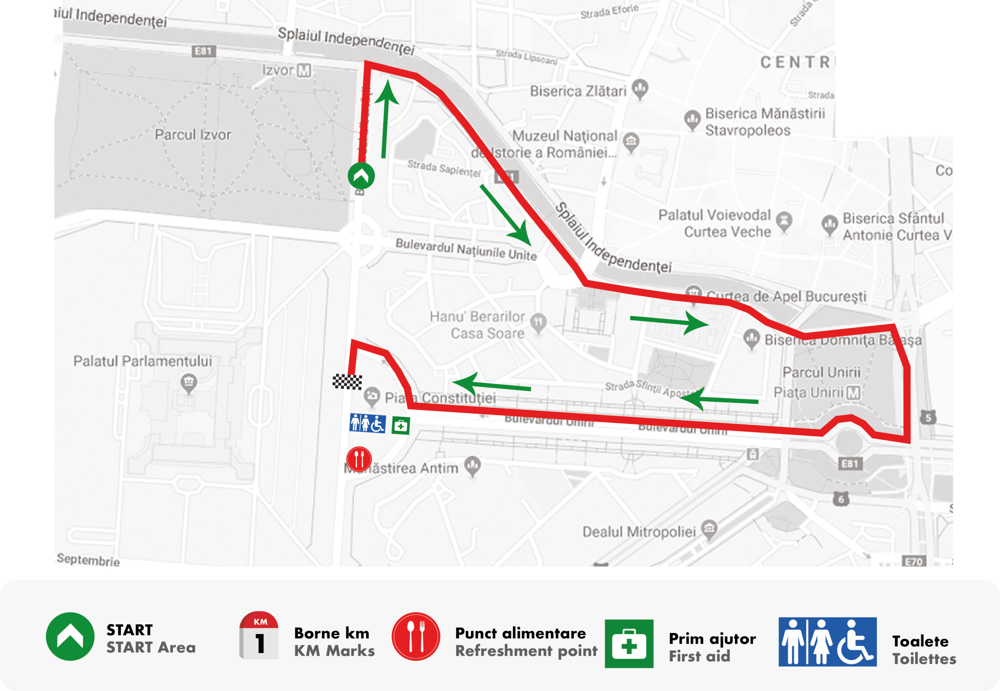
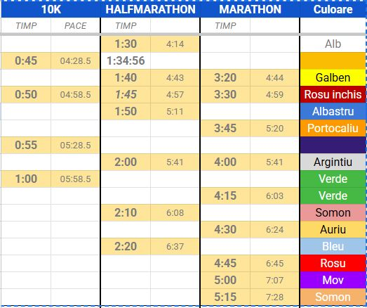

# Inaintea cursei...

## Ridicare Kit 
Kitul se poate ridica in zilele de joi (8.10) si vineri (9.10), in Piata Constitutiei intre orele 16:00 si 20:00 pe baza:
- scrisorii de confirmare a inscrierii (va fi primita in saptamana evenimentului) - un cod QR
- act de identitate (poza e suficienta)
Kitul se mai poate ridica si in restul zilelor (sambata si duminica) - insa nu recomand acest lucru. De regula, aceste zile sunt rezervate persoanelor care nu au domiciliul in Bucuresti.

**TIP💡**
Este posibil ca tricoul oficial al cursei sa fie ridicat de la alt stand fata de cel de unde veti ridica kitul. Dupa ce veti ridica kitul, pe baza numarului de concurs (BIB) veti ridica si tricoul de la un stand separat.
Toate standurile de unde se pot ridica kiturile si tricourile vor fi marcate corespunzator, in functie de cursa aleasa.

## Echipament 
- Regula de aur este: nimic nou in ziua cursei (pantofi, tricou, etc)- alergati cel putin o data in echipamentul in care planuiti sa faceti cursa. Alte recomandari:
- Luați un mic dejun ușor, familiar și testat anterior, cu aproximativ 2-3 ore înainte de start. Nu experimentați cu alimente noi în dimineața cursei.- pentru cursele mai lungi, alimentatia incepe cu minim o zi inainte (carbohidratii sunt recomandati).
- atentie la iritatii (vorbesc din experienta proprie). Recomand creme anti-frecare sau plasturi (in special pt. baieti)

## Program curse 
**Sambata** vor avea loc cursele de 10km si 2.5 km individual, incepand cu orele:
- *08:45 Wheelchairs 10km*
- 09:00 pentru proba de 10km individual
- *11:45 Wheelchairs FunRace 2.5km*
- 12:00 pentru proba de 2.5km (Fun Race)
Atentie la intrarea in Piata Constitutiei (in special la traversarea bulevardului), deoarece concurentii la probele de 10km Wheelchairs vor incepe cu 15 minute mai devreme (sa nu-i incurcati).

**Duminica** au loc probele de 42km individual si stafeta, si de 21km.
- 09:00 START probele de 42km (individual si stafeta) si 21km

## Traseul curselor 
În zona evenimentului există un serviciu de garderobă/depozitare pentru obiectele personale. Urmați indicațiile organizatorilor privind predarea și identificarea bagajului.
Zona evenimentului este în Piața Constituției. Startul curselor are loc pe Bd. Libertății, în dreptul Parcului Izvor, iar sosirea este în Piața Constituției.

- Cursa de 2.5 km (FunRace) - timp limita: 60 minute

- Cursa de 10 km - timp limita: 90 minute.
<iframe src="https://routes.rungoapp.com/embedded/U16rFVe8OL?units=km&hasTurns=false&hasPOIs=true&hideMetrics=false&isStatic=true" width="800px" height="650px" name="10K"></iframe>
- Cursa de 21 km - timp limita: 3 ore
<iframe src="https://routes.rungoapp.com/embedded/IFeOlXxHAE?units=km&hasTurns=false&hasPOIs=true&hideMetrics=false&isStatic=true" width="800px" height="650px" name="Half Marathon"></iframe>
- Cursa de 42 km - timp limita: 6 ore
<iframe src="https://routes.rungoapp.com/embedded/jixjKopjsK?units=km&hasTurns=false&hasPOIs=true&hideMetrics=false&isStatic=true" width="800px" height="650px" name="Bucharest MARATHON Race"></iframe>

**TIP💡**
- timpul limita se masoara incepand cu startul cursei (gun point) si trecerea de linia de sosire (poarta de FINISH). BIB-ul contine un tracker pe baza caruia se masoara timpul)
- cu exceptia cursei de 2.5km, toate celelalte curse vor avea puncte de hidratare pe traseu (apa, fructe, sucuri etc), respectiv toalete;
- pe traseul curselor nu vor circula masini (circulatia va fi oprita). Atentie insa la pietoni sau curiosii rataciti 😁
- dupa expirarea timpului limita, circulatia se redeschide. 
- pe traseu, vor fi si fotografi oficiali ai evenimentului (de la care veti primi pozele ulterior, pe baza BIB-ului); incercati sa dati bine in poze (macar de aparenta 😁)
- Cu aproximativ jumatate de ora inaintea fiecarei cursa, pe scena vor urca instructorii WorldClass care va vor arata cateva exercitii pentru incalzire; dupa fiecare cursa, vor fi exercitii de post-efort (intinderi).

**ATENTIE**
- pentru alergatorii la cursa de 10km **Coridorul de start este împărțit în sectoare. Fiecare alergător va avea acces doar în sectorul care îi este atribuit conform numărului de concurs (BIB).**
- e bine sa memorati BIB-ul (notati numarul de concurs) pentru a avea acces la pozele oferite de organizatori (apar cam dupa o saptamana dupa event)
- dacă depășiți timpul-limită, este posibil să nu mai fiți incluși în clasamentul oficial și trebuie să respectați instrucțiunile organizatorilor privind continuarea/oprirerea cursei.

## Important de stiut
- Incercati sa sositi in Piata Constitutiei cu transportul public (statia metrou Izvor - cel mai rapid mod de a ajunge); nu recomand masina personala pentru ca veti gasi foarte greu loc de parcare.
- Pentru ziua de sambata: inainte de startul cursei de 10km recomand sa ne intalnim la ora 08:45 in dreptul scenei pentru o poza de grup
- Concurentii la proba de 2.5km: incercati sa va strangeti in jurul orei de 11:45 in dreptul scenei pentru a doua poza de grup.

# In timpul cursei...
*Nu va asezati in prima linie de concurenti*. Aceste locuri sunt de regula rezervate alergatorilor de elita (de la federatiile olimpice sau cluburile sportive) - aceasta este regula "nescrisa" in cursele sportive. La alte maratoane internationale, exista asa numitele "zone de start".
Începeți controlat. În primii 1-2 km este preferabil să alergați puțin mai lent decât ritmul-țintă, mai ales din cauza aglomerației. Nu încercați să recuperați imediat secundele pierdute la start.

## Echipele de paceri 
Pacerii sunt alergători experimentați care mențin un ritm constant pe parcursul cursei, pentru a ajuta participanții să atingă un anumit timp-țintă. Aceștia sunt ușor de identificat (vor purta steaguri de diferite culori) și aleargă într-un ritm prestabilit, astfel încât să ajungă la linia de sosire cât mai aproape de timpul indicat.
Recomand sa stati alaturi de paceri, atat inaintea cursei (ei se vor aseza in zona de start recomandata) cat si in timpul cursei, in special daca sunteti la prima cursa de acest gen. Culorile pentru echipele de paceri sunt cele de jos

**TIP💡**
- De exemplu, un pacer de 50 min la o cursă de 10 km va urmări să ajungă la finish în aproximativ 50 de minute, menținând ritmul necesar pe traseu.
- Pacerii vor avea ritmul constant; cu toate astea, in primii 2-3 kilometri, va fi foarte aglomerat si prin urmare, va fi un ritm mai scazut.
- Aveti nevoie de geluri/ batoane energizante/jeleuri? La cursele de 2.5 km si 10km, probabil ca nu - micul dejun este suficent.

## Punctele de hidratare 
Pentru cursele de 10km, 21km si maraton vor fi puncte de hidratare pe traseu. Pacerii vor alerga intr-un ritm mai redus in zona punctelor de hidratare pentru a permite concurentilor sa se alimenteze.
Punctele de hidratare vor fi disponibile la fiecare 5 km. Va rog sa aruncati paharele pe care le veti primi in zona punctelor de hidratare. 

**⚠️ SIGURANȚĂ**
Dacă în timpul cursei apar amețeli, tulburări de vedere sau senzație de leșin, opriți alergarea și deplasați-vă în siguranță spre marginea traseului.
În cazul durerilor în piept, dificultăților de respirație sau unei stări generale severe, opriți efortul și solicitați imediat ajutorul echipelor medicale ale evenimentului.

**TIP💡**
Pentru alergătorii de 10 km cu un ritm mai rapid, evitați opririle bruște în zona punctelor de hidratare. Reduceți viteza progresiv și fiți atenți la alergătorii din jur.

# DUPA CURSA 
Dupa trecerea liniei de sosire, veti putea afla pozitia in clasament la adresa [https://bucharest-marathon.com/live-results-bucharest-marathon-2025/](https://bucharest-marathon.com/live-results-bucharest-marathon-2025/). Va puteti cauta pozitia dupa BIB sau dupa numele concurentului (atentie sa fiti la categoria de proba aleasa).

**TIP💡**
In momentul in care veti trece victoriosi prin poarta de FINISH, veti fi intampinati de voluntarii cursei, care va vor oferi medaliile. Dupa fiecare cursa, veti avea acces la apa, bauturi racoritoare, fructe etc (gratuit).

# INCHEIERE 
Vreau să le mulțumesc, în numele tuturor participanților, următoarelor persoane. Fără sprijinul și înțelegerea lor, participarea noastră la acest eveniment nu ar fi fost posibilă. 
- Andrei Romanescu
- Oana Boldeiu
- Irina Udrea
- Ela Oancea.

In incheiere - ultimele sfaturi
- recomand sa aveti un mic dejun lejer cu minim 2 ore inainte de cursa aleasa (in special pt alergatorii la 10km)
- ne vedem cu ~15 minute inaintea fiecarei curse pentru poza de grup
- *nu fortati - scopul pentru care suntem la aceasta cursa este sa ne distram; va recomand sa mergeti ori de cate ori veti obosi*
- hidratati-va si zambiti voluntarilor si celor de pe margine care va vor incuraja.

Daca aveti orice fel de intrebari (despre antrenamente, echipament), ma puteti contacta pe Teams sau email:
anita@scor.com

